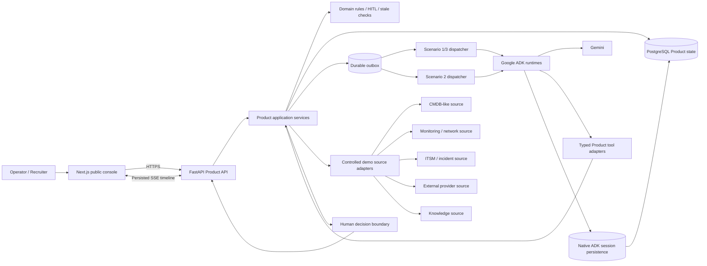
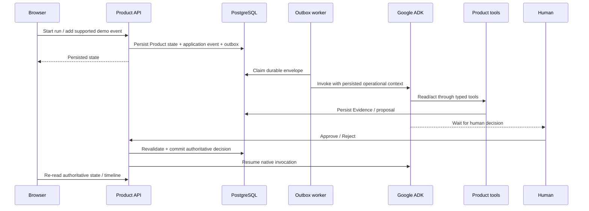

# Architecture

## System overview

The Autonomous L1 Incident Agent separates **business truth** from **agent
runtime state**.

## Ownership boundaries

### Product owns business truth

The Product layer owns:

- runs and incidents;
- Evidence;
- action / Major Incident proposals;
- approvals and rejections;
- executed demo actions;
- work orders / Major Incidents;
- application events;
- durable dispatch state;
- stale revalidation and exactly-once rules.

The model cannot directly declare that a business action happened.

### ADK owns agent runtime continuity

Google ADK owns:

- native agent execution;
- tool-calling lifecycle;
- session continuity;
- invocation continuity;
- long-running human-decision wait/resume behavior.

The project does not implement a second generic session/runtime framework.

### Browser is a read/control surface

The frontend:

- starts persisted Product runs;
- reads Product state;
- consumes persisted event timelines through SSE;
- sends human approval/rejection;
- advances the bounded Scenario 2 simulator.

It does not orchestrate model planning.

## Write path

## Recovery model

Recovery is based on persisted truth rather than browser memory.

- Product state survives frontend refresh/reopen.
- SSE reconnect uses persisted event sequence/cursor.
- Durable outbox allows redelivery after process failure.
- ADK sessions are persisted in the database.
- Human decisions are idempotent.
- Approval-time revalidation can mark a proposal stale instead of executing it.
- Replay cannot create duplicate actions/work orders.

## Public-demo boundary

Public demo mode is intentionally simple:

- one fixed server-side demo tenant;
- exact CORS allowlist;
- hidden internal/acceptance mutation routes;
- hidden direct Scenario 2 raw ingestion;
- simple in-process cooldown for new Gemini-backed demo runs;
- safe API errors;
- static bundle secret audit.

This is a portfolio demo boundary, not enterprise authentication/RBAC.

## Reasoning privacy

Persisted Product state and UI may contain:

- tool calls;
- safe tool results;
- Product Evidence;
- application events;
- concise model output.

Hidden chain-of-thought is not persisted or displayed.
