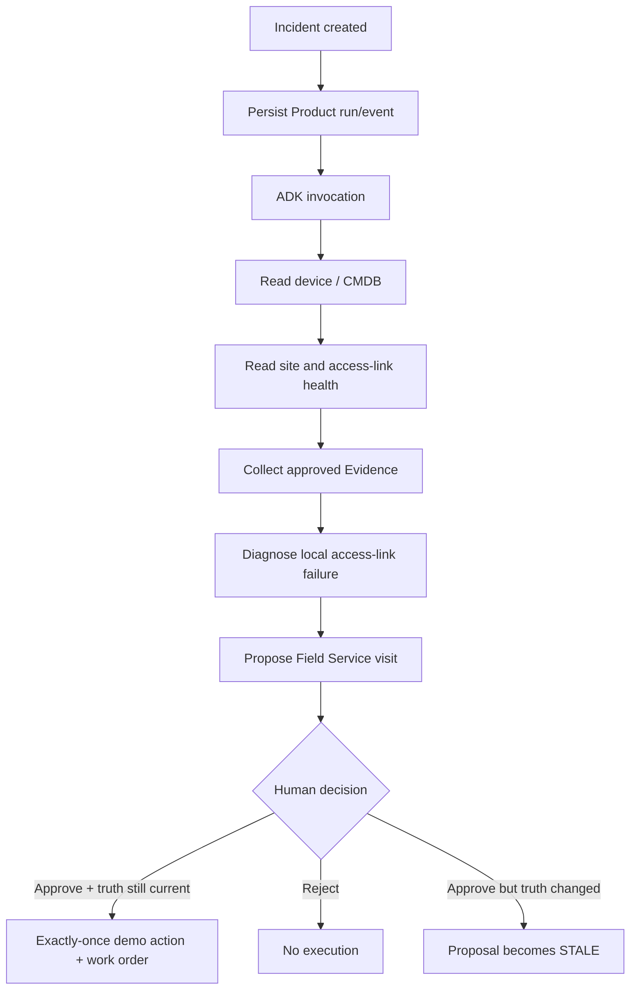
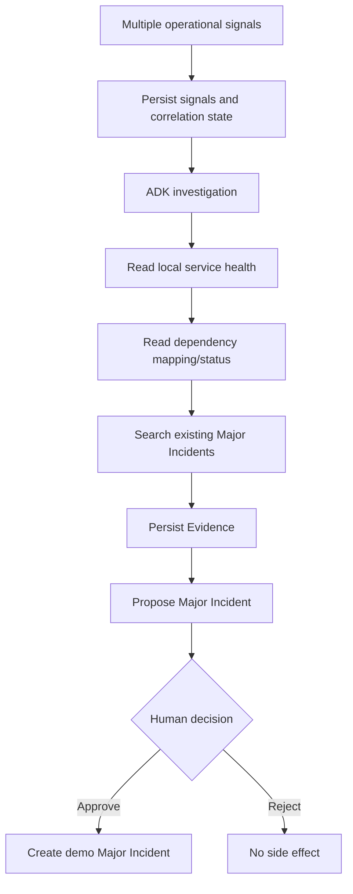
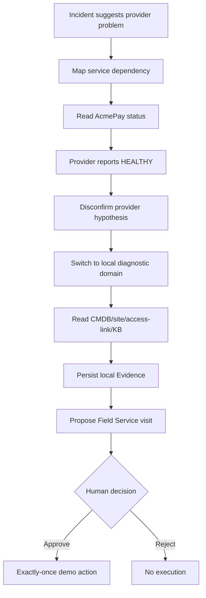

# Demo Scenarios

The three scenarios are designed to demonstrate different agent behaviors while
keeping Product ownership and HITL rules consistent.

## Comparison

| Scenario | What happens | What the agent demonstrates | Human-controlled outcome |
| --- | --- | --- | --- |
| 1 — Local device incident | One terminal/device is unreachable | Local diagnosis using CMDB, monitoring, diagnostics and KB Evidence | Field Service proposal |
| 2 — Multi-event service incident | Multiple signals point to one service/dependency problem | Correlation, provider/service investigation and Major Incident reasoning | Major Incident proposal |
| 3 — Evidence-driven replanning | Initial provider hypothesis is disproved | Hypothesis revision and switch from provider domain to local diagnostics | Field Service proposal |

## Scenario 1 — local access-link failure

This scenario demonstrates that the model may investigate and propose, but
Product code owns validation and execution.

## Scenario 2 — multi-event / Major Incident

The public browser advances a finite deterministic signal sequence. Raw signal
injection is not exposed in public-demo mode.

## Scenario 3 — replanning after disconfirmation

The important behavior is not merely using more tools. The agent changes its
investigation path because new Evidence contradicts its first hypothesis.

## What is mocked in the portfolio demo

The repository uses controlled source adapters rather than live customer
systems for:

- monitoring/network health;
- CMDB;
- ITSM incident data;
- knowledge articles;
- external provider health;
- Field Service / Major Incident side effects.

The architecture is built so those sources are behind typed Product
boundaries. The demo does not pretend to execute changes in real customer
infrastructure.

## What is real

The following are real project behavior:

- Google ADK runtime integration;
- Gemini tool calling;
- PostgreSQL Product persistence;
- native ADK session persistence;
- durable dispatch/outbox;
- Evidence persistence;
- HITL pause/resume;
- stale/idempotency/exactly-once rules;
- SSE timeline/recovery;
- three-scenario browser UI;
- deterministic release gate.
